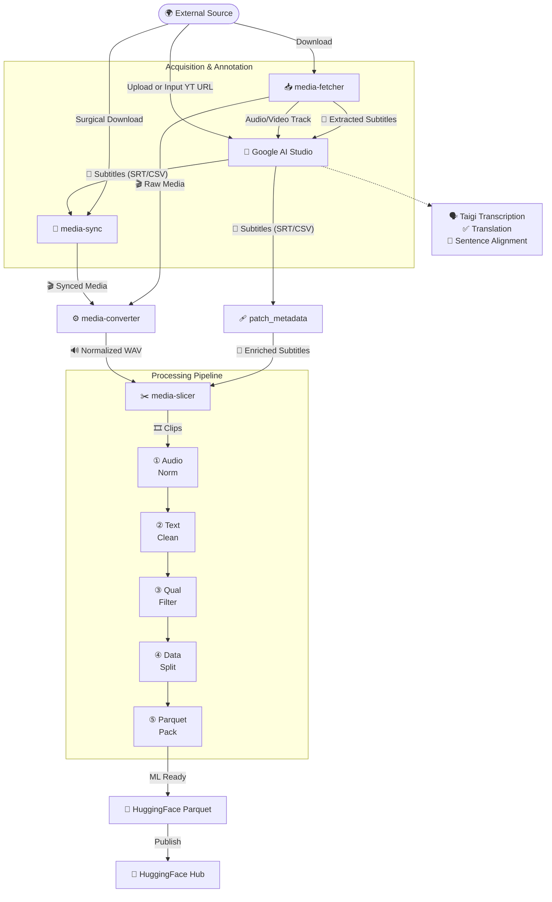

# Taigi Voice Datasets Packager

**Taigi Voice Datasets Packager** is a comprehensive toolset for fetching YouTube subtitles, slicing media, and packaging AI datasets (Automatic Speech Recognition or Text-To-Speech). It allows you to download videos/audio, extract and convert subtitles, edit media clips, and run a master pipeline for formatting, cleaning, and packaging machine learning datasets into Parquet shards ready for Hugging Face or local use.

**Note:** This repository is fundamentally designed for **AI Agent Skill use** (allowing autonomous agents to execute complex dataset creation tasks), but every tool is also fully exposed and perfectly usable as standalone **CLI scripts** for human developers.

## 📊 Visual Overview

### Skills Ecosystem



---

## 🤖 Google AI Studio Integration

While `media-fetcher` can acquire existing subtitles, this ecosystem is specifically designed to leverage **[Google AI Studio](https://aistudio.google.com/)** (using **Gemini 1.5 Pro** or newer) for high-precision, zero-shot annotation. Gemini's massive context window and native multimodal audio understanding make it ideal for processing entire media files directly, without intermediate text-based ASR pipelines.

### 1. Taigi Transcription & Multilingual Translation

For low-resource languages like Taigi or cross-lingual dataset construction:

- **Direct Audio-to-Text:** Upload raw video or extracted audio directly to AI Studio. Gemini translates and transcribes straight from the audio track, capturing acoustic nuance, emotion, and speaker intent far better than standard text-to-text translation.
- **Subtitle Translation:** Alternatively, extract existing subtitles using `media-fetcher`, upload the text to AI Studio, and prompt Gemini to translate them into your target language (e.g., Taigi) while maintaining precise timestamps and structural integrity.
- **Orthographic Control:** Gemini excels at specific orthographies. Prompt it to output your exact target format (e.g., *"Transcribe this audio into Taiwanese Hokkien using Han-lô (mixed Han characters and Pe̍h-ōe-jī). Ensure tone markers are precise."*).
- **TTS Pre-Optimization:** Instruct the model to spell out numbers and remove special characters during the transcription phase, saving work in the `dataset-packager` stage.

### 2. Sentence-Aligned SRT Generation

The `media-slicer` relies heavily on exact timestamps. Standard YouTube auto-captions often break sentences across multiple subtitle blocks mid-speech, which produces fragmented clips that poison ASR/TTS training.

- **Semantic Segmentation:** Use Gemini to force strict semantic boundaries.
- **Suggested Prompting Strategy:**
  > *"Act as an expert audio annotator. Listen to this file and generate a standard `.srt` subtitle file. **CRITICAL:** Every single SRT block must contain exactly ONE complete, grammatically whole sentence. Do not split sentences across multiple blocks, and do not combine multiple sentences into one block. Provide precise start and end millisecond timestamps."*
- **Alignment Synergy:** While LLM-generated timestamps might exhibit minor millisecond drift, `media-slicer` is specifically built to handle this. By utilizing its `--lead`, `--tail`, and `--mute-pad` arguments, the slicer creates clean acoustic cuts around the AI's semantic timestamps, guaranteeing high-quality training pairs.

---

### AI Agent Skills

The primary capabilities of this repository are organized into four core "skills" located under the `.agent/skills/` directory:

1. **`media-fetcher`**: Responsible for discovering, extracting, and downloading source media from YouTube, Facebook, and X.
2. **`media-slicer`**: Provides tools to segment large media files into smaller, dataset-ready clips based on subtitle timestamps.
3. **`media-converter`**: A utility skill dedicated to standardizing media (e.g., 16kHz WAV, LUFS normalization).
4. **`dataset-packager`**: The orchestration and finalization engine that runs the 5-stage master pipeline.

## Features

- **Media Fetching**: Download media and subtitles, extract JSON for AI translation, and sync media with sub-second accuracy.
- **Media Slicing**: Precision clipping based on SRT/CSV with configurable padding and "bleed" prevention.
- **Media Converting**: Bulk conversion with EBU R128 loudness normalization and sample rate standardization.
- **Dataset Packaging**: A robust 5-stage pipeline: Audio Normalizer, Text Cleaner, Quality Filter (SNR/CER), Split Dataset (Speaker-Aware), and Parquet Packager.

---

## Installation

### Standard Installation

```bash
git clone https://github.com/CyberOohim/taigi_voice_datasets_packager.git
cd taigi_voice_datasets_packager
pip install -e .
```

### Installation with GPU / Whisper Support

```bash
pip install -e .[gpu]
```

This installs `torch`, `torchvision`, `torchaudio`, and `openai-whisper` for Stage 3 CER verification.

---

## Configuration

Before using the tools, set up your environment variables by copying the example file:

```ps1
cp .env.example .env
```

Update the `.env` file with your Hugging Face credentials:
- `HF_REPO_ID`: Your target Hugging Face repository (e.g., `username/my-taigi-dataset`).
- `HF_TOKEN`: your [Hugging Face User Access Token](https://huggingface.co/settings/tokens) (requires **write** permission).

---

## Tools and Usage

### Media Fetcher Tools

| Command Alias | Description |
|:---|:---|
| `media-fetch-subs` | Download transcripts from YouTube (SRT/CSV). |
| `media-fetch-subs-fb`| Download captions from Facebook/others via JSON. |
| `media-download-video` | Extract high-quality video from URL. |
| `media-download-audio` | Extract audio tracks (MP3, M4A, WAV). |
| `media-convert-subs` | Convert between `.srt` and `.csv`. |
| `media-extract-json` | Extract text to JSON for AI translation. |
| `media-merge-translations` | Merge translated JSON back into subtitles. |
| `media-edit-sub` | Surgical clipping from URL or local files. |
| `media-sync` | Sync-download partial media based on subtitle range. |
| `media-patch-meta` | Patch subtitle headers with live metadata. |

### Media Slicer Tools

| Command Alias | Description |
|:---|:---|
| `media-slice` | Split media into hundreds of labeled clips based on subtitles. |
| `media-compile` | Concatenate "good" segments into one continuous file. |

### Media Converter Tools

| Command Alias | Description |
|:---|:---|
| `media-conv` | Bulk conversion, info inspection, and loudness normalization. |

### Dataset Packager Tools

#### `dataset-pack`
The `dataset-packager` is a unified 5-stage pipeline that standardizes raw clips into a format ready for training models.

**Pipeline Stages:**

1. **Audio Normalizer (Stage 1):** Ensures all audio clips have the exact same sample rate (default 16kHz) and integrated loudness (default -23 LUFS).
2. **Text Cleaner (Stage 2):** Normalizes transcriptions. In `--tts` mode, it preserves casing/punctuation and expands numbers; in ASR mode, it can remove punctuation.
3. **Quality Filter (Stage 3):** Automatically discards "trash" clips based on:
   - **Signal-to-Noise Ratio (SNR):** Filters out noisy audio.
   - **Character Error Rate (CER):** Uses Whisper-tiny to verify transcription accuracy.
   - **Speaking Rate:** Filters clips that are too fast or too slow (Words Per Second).
   - **Duration:** Ensures clips fit within a target window (e.g., 1-15s).
4. **Split Dataset (Stage 4):** Partitions data into `train`, `val`, and `test` sets. Supports **Speaker-Aware splitting** to ensure a speaker in training never appears in the test set.
5. **Packager (Stage 5):** Encodes audio directly into **Parquet shards**. Enables instant loading via the Hugging Face `datasets` library without managing thousands of loose files.

**Example Usage:**
```bash
dataset-pack --dataset-name "taigi-asr" --sr 16000 --filter-audio --min-snr 20.0 --push-to-hub user/taigi-asr
```

---

## 🔄 Chained Workflow (Raw-to-Parquet)

1. **Acquire:** Download via `media-fetcher` or prepare local files.
2. **Annotate:** Use **Google AI Studio (Gemini)** to generate high-precision Taigi transcriptions or sentence-aligned SRTs.
3. **Normalize:** Standardize source media format.

   ```bash
   media-conv convert source.mp4 -f wav -r 16000 -c 1 --normalize-two-pass
   ```

4. **Slice:** Create granular clips from the normalized audio.

   ```bash
   media-slice --input source.wav --subs source.srt --out clips/source
   ```

5. **Package:** Run the master pipeline to filter and pack.

   ```bash
   dataset-pack --clips clips/source --dataset-name my-dataset --push-to-hub my-org/my-dataset
   ```

---

## License

MIT License

Copyright (c) 2024 Taigi Voice Datasets Packager Contributors
